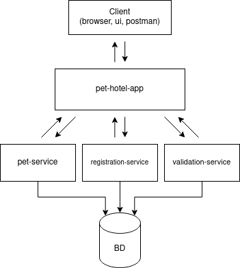

# Отель для животных

## Для чего?

Сервис для людей которые уезжают на отдых и им не с кем оставить своих  
домашних питомцев

---

## Как запустить?

**Требования**  
Для запуска понадобится java 11+, docker и docker-compose

**Запуск _(в UNIX подобной OC)_**  
1) Переходим в папку с проектом: ``cd pet-hotel``
2) Даем разрешения на запуск скрипта: ``chmod +x clean-build.sh``
3) Запускаем его: ``./clean-build.sh``  
_(Этот скрипт соберет джариники и распакует слои в папку /build/extracted)_
4) Запускаем docker-compose: ``docker-compose up -d --build``

После этих шагов запустятся все сервисы и база данных.

---

## Что делать дальше?

К проекту подключен swagger, зайдя на http://localhost:8080/swagger-ui/index.html  
можно получить к нему доступ, посмотреть доступные эндпоинты и сделать какие-то запросы.
Глубже со всем этим можно ознакомиться [тут](#services).  
(По умолчанию проект запускается на 8080 порту, postgres на 5432 c url  
`jdbc:postgresql://localhost:5432/pet_db`) 

---

## Services

В проекте используются внешние сервисы:  
1) Сервис предоставляющий CRUD операции с домашними 
питомцами **[pet-service](./pet-service/README.md)**

2) Сервис регистрации пользователей **[registration-service](./registration-service/README.md)**

3) Сервис валидации логинов **[validation-service](./validation-service/README.md)**

Эти сервисы вызываются через главное приложение **[pet-hotel-app](./pet-hotel-app/README.md)**

---

## Взаимодействие сервисов:
